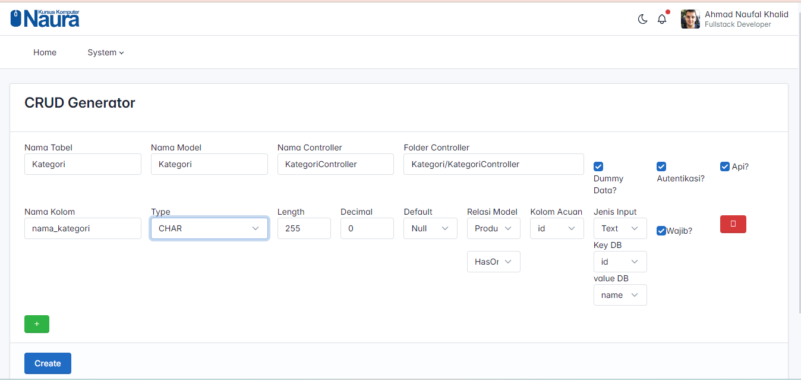

## Crud Generator dengan Laravel

<ol>
    <li>Membuat Migration Otomatis</li>
    <li>Membuat Model Otomatis</li>
    <li>Membuat Relasi Otomatis</li>
    <li>Membuat Controller Otomatis</li>
    <li>Membuat dummy Otomatis</li>
    <li>Membuat API Otomatis</li>
    <li>Membuat Postman Collection Otomatis</li>
    <li>Membuat Auth APi Otomatis</li>
    <li>Membuat View Otomatis</li>
    <li>Membuat Route Web Otomatis</li>
    <li>Membuat Route API Otomatis</li>
</ol>
<h3>Cara Menggunakan</h3>
<ol>
    <li>
        Clone Proyek
        <pre>
            git clone https://github.com/gudangcoding/laravel-10-crud-generator.git
        </pre>
    </li>
    <li>
        Install Denpendency
        <pre>
            composer install
        </pre>
    </li>
    <li>
        Setting database pada file .env
        <pre>
           .
        </pre>
    </li>
    <li>
        Jalankan migration
        <pre>
            php artisan migrate --dbseed
        </pre>
    </li>
</ol>
